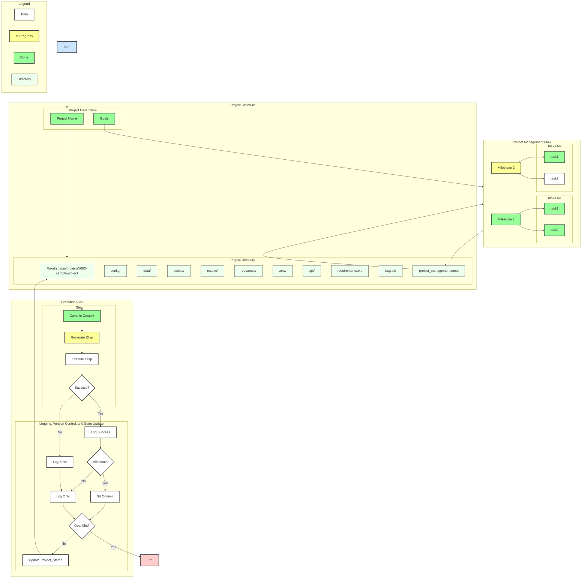

<!-- ---
!-- Timestamp: 2025-05-11 13:27:06
!-- Author: ywatanabe
!-- File: /home/ywatanabe/.claude/commands/understand.md
!-- --- -->

# Request
- Understand and remember the following programming guidelines for my projects
- Do not care about **Response Length**. When necessary, I will prompt you "continue" in the next interaction
- Do not be lazy and skip lines of code

# Programming Guidelines & Standards

## !!! IMPORTANT !!! Test-Driven Development Workflow !!! IMPORTANT !!!
The most important guideline in this document is that we adopt test-driven development workflow as follows:
1. **Start with tests**
   - We're following test-driven development 
   - Write tests before writing source code
   - Write tests based on expected input/output pairs
   - Avoid mock implementations
   - Tests should target functionality that doesn't exist yet
   - Implement `./run-tests.sh` with these options:
     ```
     -d|--debug     Enable debug output. <- DO NOT USE this unless explicitly requested
     -h|--help      Display this help message"
     -s|--single    Run a single test file"
     ```
   - Prioritize test over source
     - The quality of test is the quality of the project
   - Test code should have the expected directory structure in the language and project goals

2. **Verify test failure**
   - Run the tests to confirm they fail first
     - Our aim is now clear; all we need is to solve the failed tests
   - Not to write implementation code yet

3. **Git commit test files**
   - Review the tests for completeness to satisfy the project goals and requirements
     - Not determine the qualities of test files based on source files
       - Prioritize test code over source code
       - Thus, test code MUST BE SOLID
   - Commit the tests when satisfied

4. **Implement functionality**
   - If the above steps 1-3 completed, now you are allowed to implement source code that passes the tests
   - !!! IMPORTANT !!! NOT TO MODIFY THE TEST FILES IN THIS STEP
   - Iterate until all tests pass

5. **Verify implementation quality**
   - Use independent subagents to check if implementation overfits to tests
   - Ensure solution meets broader requirements beyond tests

6. **Summarize the current iteration by listing:**
   - What were verified
   - What are not verified yet
     - Reasons why they are not verified if not expected

7. **Commit implementation**
   - Commit the source code once satisfied

## General Programming Rules

- **Focus on code clarity and maintainability**
  - Do Not Repeat Yourself (DRY principle)
  - Use symbolic links wisely, especially for large data to keep clear organization and easy navigation
  - Prepare `./scripts/utils/<versatile_func.py>` for versatile and reusable code
  - If versatile code is applicable beyond projects, implement in the `mngs` package
  - Avoid unnecessary comments as they can be disruptive
  - Return only the updated code without comments
  - Code should be self-explanatory; variable, function, and class names are crucial
  - Comments can be distracting if the code is properly written

- **Avoid 1-letter variable names**
  - They make searching challenging
  - For example, rename variable x to xx for better readability and searchability

- **Commenting style**
  - Subjects of comments should be "this file/code/function" implicitly
  - Verbs should be in singular form (e.g., "# Computes ..." instead of "# Compute ...")

- **Documentation**
  - Always include docstrings with example usage
  - Follow language-specific docstring format standards

- **Imports and Dependencies**
  - Keep importing packages MECE (Mutually Exclusive and Collectively Exhaustive)
  - Remove unnecessary packages and add necessary ones

- **Code Structure**
  - Use modular approaches for reusability, readability, maintainability, and scalability
  - Split functions into subroutines or meaningful chunks whenever possible

- **PATH Conventions**
  - Use relative paths from the project root
  - Relative paths should start with dots, like "./relative/example.py" or "../relative/example.txt"
  - All scripts are assumed to be executed from the project root (e.g., ./scripts/example.sh)

- **Code Block Indicators**
  - Use appropriate code block indicators:
  ```python
  # Python example
  ```
  ```shell
  # Shell example
  ```
  ```elisp
  ;; Elisp example
  ```
  ``` pseudo-code
    # Pseudo-code
  ```
  ``` plaintext
  Plain text
    ```
  ``` markdown
  Markdown Contents
  ```

- **String Formatting**
  - Split strings into shorter lines
  - For example, with f-string concatenation with parentheses in Python:
  ```python
  # Good
  error_msg = (
      f"Failed to parse JSON response: {error}\n"
      f"Prompt: {self._ai_prompt}\n"
      f"Generated command: {commands}\n"
      f"Response: {response_text}"
  )
  
  # Not Good
  error_msg = f"Failed to parse JSON response: {error}\nPrompt: {self._ai_prompt}\nGenerated command: {commands}\nResponse: {response_text}"
  ```

- **Headers and Footers**
  - Do not change headers (e.g., time stamp, file name, authors) and footers (e.g., # EOF)

- **Indentation**
  - Pay attention to indentation
  - Code will be copied/pasted as is

- **Org Report**
  - When asked, prepare report in `.org` file under `./reports` directory
  - Also, convert to PDF

## Refactoring Rules
- During development, do not change names of files, variables, functions, and so on
- Refactoring will be separately requested


## Version Control Workflow
1. Start from develop branch
2. Checkout to feature branch
3. Confirm feature branch is correctly implemented in the test-driven development schema
4. Once feature branch is verified, merge it back into develop
5. Push develop to origin/develop
6. Agents are permitted to use `git` and `gh` commands
7. SSH public key is registered in GitHub account `ywatanabe1989`

## Project Management Progress Rules

- Direction of the project is managed under `./project_management`:
  - `./project_management/progress.md`
    - Main progress management file. You should update this as project advances.
    - Use tags:
      - TODO
        - Format: [ ] contents
        - For contents that need to be addressed or completed.
      - DONE
        - Format: [x] contents
        - Fill checkbox
        - For contents that have been completed (considered as done by agents).
      - JUSTIFICATION
        - Format: __justification__ | contents
        - References to justify why you determine the contents are DONE
      - ACCEPTED: 
        - Format: __accepted__ | contents
        - For contents accepted by the user.
        - Note: Only users can add or remove this tag.
      - REJECTED:
        - Format: ~~contents~~
        - For contents rejected by the user.
        - Note: Only users can add or remove this tag.
      - SUGGESTION
        - Format: __suggestions__ | contents
        - For contents suggested by agents.

  - `./project_management/progress.mmd`
    - Mermaid diagram definition reflecting the current progress (`./project_management/progress.md`)
    - Use tags as well:

  - `./project_management/progress.svg`
    - SVG file created from the mermaid file

  - `./project_management/progress.gif`
    - GIF image created from the SVG file

  - `./project_management/ORIGINAL_PLAN.md`
    - Original plan created by the user
    - DO NOT EDIT THIS FILE

## Project Management Progress format

``` org
# +TITLE: Title
# +AUTHOR: ywatanabe
# +DATE: 2025-02-10 14:52:36
# +FILE: path to this file

* Title

| Type | Stat | Description       | User |
|------|------|-------------------|------|
| 🚀 T | [x]  | Potential Title 1 | 👍 A |
|------|------|-------------------|------|
| 🚀 T | [ ]  | Potential Title 2 | 👀 T |


* Goals, Milestones, and Tasks

** 🎯 Goal 1: Description

| Type | Stat | Description                           | User |
|------|------|---------------------------------------|------|
| 🎯 G | [ ]  | Accepted but not completed Goal       | 👍 A |
|------|------|---------------------------------------|------|
| 🏁 M | [ ]  | Accepted but not completed Milestone  | 👍 A |
|------|------|---------------------------------------|------|
| 📋 T | [x]  | Accepted and completed Task           | 👍 A |
|      | [x]  | 📊 `/path/to/data_file.ext`           | 👍 A |
|------|------|---------------------------------------|------|
| 📋 T | [x]  | Not confirmed but completed Task      | 👀 T |
|      | [x]  | 📌 `/path/to/human_readable_file.ext` | 👀 T |
|------|------|---------------------------------------|------|
| ...  |      |                                       |      |


** 🎯 Goal 2: Description

| Type | Stat | Description                           | User |
|------|------|---------------------------------------|------|
| 🎯 G | [ ]  | Goal 2                                | 👍 A |
|------|------|---------------------------------------|------|
| 🏁 M | [x]  | Milestone 1                           | 👍 A |
|------|------|---------------------------------------|------|
| 📋 T | [x]  | Task 1                                | 👍 A |
|      | [x]  | 📌 `/path/to/human_readable_file.ext` | 👍 A |
|------|------|---------------------------------------|------|
| ...  |      |                                       |      |


** 🎯 Goal 3: Description

| Type | Stat | Description             | User |
|------|------|-------------------------|------|
| 🎯 G | [ ]  | Unrealistic Goal 3      | ❌ R |
|------|------|-------------------------|------|
| 🏁 M | [ ]  | Unrealistic Milestone 1 | ❌ R |
|------|------|-------------------------|------|
| 📋 T | [ ]  | Unrealistic Task 1      | ❌ R |
|------|------|-------------------------|------|
| 📋 T | [ ]  | Unrealistic Task 2      | ❌ R |
|------|------|-------------------------|------|
| ...  |      |                         |      |

* Introduction

| Type | Stat | Description  | Direction | User |
|------|------|--------------|-----------|------|
| 🔎 H | [ ]  | Hypothesis 1 | H -> D    | 👍 A |
|------|------|--------------|-----------|------|
| 🔎 H | [ ]  | Hypothesis 2 | D -> H    | 👀 T |
|------|------|--------------|-----------|------|
| ...  |      |              |           |      |

* Methods

** Data

| Type | Stat | Description | User |
|------|------|-------------|------|
| 📊️ D | [x]  | Data 1      | 👍 A |
|------|------|-------------|------|
| 📊 D | [ ]  | Data 2      | ❌ R |
|------|------|-------------|------|
| 📊️ D | [ ]  | Data 3      | 👀 T |
| ...  |      |             |      |

** Tools

| Type | Stat | Description | User |
|------|------|-------------|------|
| 🛠️ T | [x]  | Tool 1      | 👍 A |
|------|------|-------------|------|
| 🛠️ T | [ ]  | Tool 2      | ❌ R |
|------|------|-------------|------|
| 🛠️ T | [ ]  | Tool 3      | 👀 T |
| ...  |      |             |      |


* Suggestions from Agents

| Type | Stat | Description  | User |
|------|------|--------------|------|
| 💡 S | [ ]  | Suggestion 1 | 👀 T |
|------|------|--------------|------|
| 💡 S | [ ]  | Suggestion 2 | 👀 T |
|------|------|--------------|------|
| 💡 S | [ ]  | Suggestion 3 | 👀 T |
| ...  |      |              |      |

* Legend
 
| **Type** | **Meaning**               | **Status** | **Meaning** | **User Status** | **Meaning** |
|--------|-------------------------|----------|-----------|---------------|-----------|
| 🚀 T   | Title                   | [ ]      | TODO      | 👀 T          | To see    |
|--------|-------------------------|----------|-----------|---------------|-----------|
| 🔎 H   | Hypothesis              | [x]      | DONE      | ❌ R          | Rejected  |
|--------|-------------------------|----------|-----------|---------------|-----------|
| 🎯 G   | Goal                    |          |           | 👍 A          | Accepted  |
|--------|-------------------------|----------|-----------|---------------|-----------|
| 🏁 M   | Milestone               |          |           |               |           |
|--------|-------------------------|----------|-----------|---------------|-----------|
| 📋 T   | Task                    |          |           |               |           |
|--------|-------------------------|----------|-----------|---------------|-----------|
| 🛠️ T   | Tool (as Justification) |          |           |               |           |
|--------|-------------------------|----------|-----------|---------------|-----------|
| 📊 D   | Data (as Justification) |          |           |               |           |
|--------|-------------------------|----------|-----------|---------------|-----------|
| 📌 J   | File as Justification   |          |           |               |           |

# EOF
```

### Progress Format
```
* Title

| Type | Stat | Description       | User |
|------|------|-------------------|------|
| 🚀 T | [x]  | Potential Title 1 | 👍 A |
|------|------|-------------------|------|
| 🚀 T | [ ]  | Potential Title 2 | 👀 T |

* Goals, Milestones, and Tasks

** 🎯 Goal 1: Description

| Type | Stat | Description                           | User |
|------|------|---------------------------------------|------|
| 🎯 G | [ ]  | Accepted but not completed Goal       | 👍 A |
|------|------|---------------------------------------|------|
| 🏁 M | [ ]  | Accepted but not completed Milestone  | 👍 A |
|------|------|---------------------------------------|------|
| 📋 T | [x]  | Accepted and completed Task           | 👍 A |
|      | [x]  | 📊 `/path/to/data_file.ext`           | 👍 A |
```

### Legend for Project Management
```
| **Type** | **Meaning**               | **Status** | **Meaning** | **User Status** | **Meaning** |
|--------|-------------------------|----------|-----------|---------------|-----------|
| 🚀 T   | Title                   | [ ]      | TODO      | 👀 T          | To see    |
|--------|-------------------------|----------|-----------|---------------|-----------|
| 🔎 H   | Hypothesis              | [x]      | DONE      | ❌ R          | Rejected  |
|--------|-------------------------|----------|-----------|---------------|-----------|
| 🎯 G   | Goal                    |          |           | 👍 A          | Accepted  |
|--------|-------------------------|----------|-----------|---------------|-----------|
| 🏁 M   | Milestone               |          |           |               |           |
|--------|-------------------------|----------|-----------|---------------|-----------|
| 📋 T   | Task                    |          |           |               |           |
|--------|-------------------------|----------|-----------|---------------|-----------|
| 🛠️ T   | Tool (as Justification) |          |           |               |           |
|--------|-------------------------|----------|-----------|---------------|-----------|
| 📊 D   | Data (as Justification) |          |           |               |           |
|--------|-------------------------|----------|-----------|---------------|-----------|
| 📌 J   | File as Justification   |          |           |               |           |
|--------|-------------------------|----------|-----------|---------------|-----------|
| 💡 S   | Suggestion              |          |           |               |           |
```


## Project Management Progress Example

``` org
# +TITLE: MNIST Digit Classification Project
# +AUTHOR: ywatanabe
# +DATE: 2025-02-10 14:52:36
# +FILE: /home/ywatanabe/proj/llemacs/resources/prompts/components/examples/mgmt-progress.org

* Title

| Type | Stat | Description                        | User |
|------|------|------------------------------------|------|
| 🚀 T | [x]  | *mnist digit clf*                  | 👍 A |
|------|------|------------------------------------|------|
| 🚀 T | [ ]  | *MNIST Digit Classification Project* | 👍 A |


* Goals, Milestones, and Tasks

** 🎯 Goal 1: Prepare and Preprocess Data

| Type | Stat | Description                                  | User |
|------|------|----------------------------------------------|------|
| 🎯 G | [ ]  | Prepare and Preprocess Data                  | 👍 A |
|------|------|----------------------------------------------|------|
| 🏁 M | [x]  | Acquire MNIST Dataset                        | 👍 A |
|------|------|----------------------------------------------|------|
| 📋 T | [x]  | Download MNIST training and testing datasets | 👍 A |
|      | [x]  | 📊 ./data/mnist/                             | 👍 A |
|------|------|----------------------------------------------|------|
| 🏁 M | [ ]  | Preprocess and Augment Data                  | 👀 T |
|------|------|----------------------------------------------|------|
| 📋 T | [ ]  | Normalize pixel values                       | 👀 T |
|      | [ ]  | 📌 ./scripts/mnist/normalization.py          | 👀 T |
|------|------|----------------------------------------------|------|
| 📋 T | [ ]  | Reshape and format data for model input      | 👀 T |
|      | [ ]  | 📌 ./scripts/mnist/reshape.py                | 👀 T |
|------|------|----------------------------------------------|------|
| 📋 T | [ ]  | Perform data augmentation techniques         | 👀 T |
|      | [ ]  | 📌 ./scripts/mnist/data_augmentation.py      | 👀 T |

** 🎯 Goal 2: Develop and Train Baseline CNN Model

| Type | Stat | Description                                                    | User |
|------|------|----------------------------------------------------------------|------|
| 🎯 G | [ ]  | Develop and Train Baseline CNN Model                           | 👍 A |
|------|------|----------------------------------------------------------------|------|
| 🏁 M | [x]  | Design CNN architecture                                        | 👍 A |
|------|------|----------------------------------------------------------------|------|
| 📋 T | [x]  | Define the number of layers and filters                        | 👍 A |
|      | [x]  | 📌 Configuration in `./config/cnn_config.yaml`                 | 👍 A |
|------|------|----------------------------------------------------------------|------|
| 📋 T | [x]  | Select activation functions and pooling strategies             | 👍 A |
|      | [x]  | 📌 Details in `./config/cnn_config.yaml`                       | 👍 A |
|------|------|----------------------------------------------------------------|------|
| 🏁 M | [ ]  | Implement the CNN model in code                                | 👀 T |
|------|------|----------------------------------------------------------------|------|
| 📋 T | [ ]  | Code the model using Keras API                                 | 👀 T |
|      | [ ]  | 📌 Code to be written in `./models/cnn_model.py`               | 👀 T |
|------|------|----------------------------------------------------------------|------|
| 📋 T | [ ]  | Compile the model with appropriate optimizer and loss function | 👀 T |
|------|------|----------------------------------------------------------------|------|
| 📋 T | [ ]  | Train the model on preprocessed MNIST training data            | 👀 T |
|------|------|----------------------------------------------------------------|------|
| 📋 T | [ ]  | Set training parameters (epochs, batch size)                   | 👀 T |
|------|------|----------------------------------------------------------------|------|
| 📋 T | [ ]  | Monitor training progress and adjust as necessary              | 👀 T |

** 🎯 Goal 3: Evaluate Model Performance

| Type | Stat | Description                                         | User |
|------|------|-----------------------------------------------------|------|
| 🎯 G | [ ]  | Evaluate Model Performance                          | 👍 A |
|------|------|-----------------------------------------------------|------|
| 🏁 M | [ ]  | Test the model on MNIST testing data                | 👀 T |
|------|------|-----------------------------------------------------|------|
| 📋 T | [ ]  | Calculate accuracy and loss on test set             | 👀 T |
|------|------|-----------------------------------------------------|------|
| 📋 T | [ ]  | Generate confusion matrix and classification report | 👀 T |


** 🎯 Goal 4: Improve Model Accuracy and Generalization

| Type | Stat | Description                                             | User |
|------|------|---------------------------------------------------------|------|
| 🎯 G | [ ]  | Improve Model Accuracy and Generalization               | 👍 A |
|------|------|-----------------------------------------------------|------|
| 🏁 M | [ ]  | Apply Additional Data Augmentation Techniques           | 💡 S |
|------|------|-----------------------------------------------------|------|
| 📋 T | [ ]  | Implement random rotations, shifts, and flips           | 💡 S |
|      | [ ]  | 📌 Enhances model robustness to variations | 💡 S |
|------|------|-----------------------------------------------------|------|
| 📋 T | [ ]  | Retrain the model with augmented data                   | 💡 S |
|------|------|-----------------------------------------------------|------|
| 🏁 M | [ ]  | Perform Hyperparameter Tuning                           | 💡 S |
|------|------|-----------------------------------------------------|------|
| 📋 T | [ ]  | Adjust learning rates, batch sizes, and optimizer types | 💡 S |
|------|------|-----------------------------------------------------|------|
| 📋 T | [ ]  | Use techniques like grid search or random search        | 💡 S |
|------|------|-----------------------------------------------------|------|
| 🏁 M | [ ]  | Implement Regularization Methods                        | 💡 S |
|------|------|-----------------------------------------------------|------|
| 📋 T | [ ]  | Add dropout layers to prevent overfitting               | 💡 S |
|------|------|-----------------------------------------------------|------|
| 📋 T | [ ]  | Apply L1/L2 regularization to weights                   | 💡 S |

* Introduction

| Type | Stat | Description                                                                                  | User |
|------|------|----------------------------------------------------------------------------------------------|------|
| 🔎 H | [ ]  | Implementing a CNN will achieve over 99% accuracy on MNIST.                                  | 👀 T |
|------|------|----------------------------------------------------------------------------------------------|------|
| 🔎 H | [ ]  | Applying data preprocessing and augmentation will improve model accuracy and generalization. | 👀 T |

* Methods

** Tools

| Type | Stat | Description                                       | User |
|------|------|---------------------------------------------------|------|
| 🛠️ T  | [x]  | Python programming language.                      | 👍 A |
|------|------|---------------------------------------------------|------|
| 🛠️ T  | [x]  | TensorFlow and Keras libraries for deep learning. | 👍 A |
|------|------|---------------------------------------------------|------|
| 🛠️ T  | [ ]  | GPU resources for accelerated training.           | 👀 T |

* Suggestions from Agents

| Type | Stat | Description                                                                                   | User |
|------|------|-----------------------------------------------------------------------------------------------|------|
| 💡 S | [ ]  | Experiment with batch normalization layers to improve training speed and stability.           | 👀 T |
|------|------|-----------------------------------------------------------------------------------------------|------|
| 💡 S | [ ]  | Try deeper network architectures like ResNet or DenseNet for potential accuracy improvements. | 👀 T |
|------|------|-----------------------------------------------------------------------------------------------|------|
| 💡 S | [ ]  | Implement cross-validation to obtain more reliable estimates of model performance.            | 👀 T |

* Legend
 
| **Type** | **Meaning**               | **Status** | **Meaning** | **User Status** | **Meaning** |
|--------|-------------------------|----------|-----------|---------------|-----------|
| 🚀 T   | Title                   | [ ]      | TODO      | 👀 T          | To see    |
|--------|-------------------------|----------|-----------|---------------|-----------|
| 🔎 H   | Hypothesis              | [x]      | DONE      | ❌ R          | Rejected  |
|--------|-------------------------|----------|-----------|---------------|-----------|
| 🎯 G   | Goal                    |          |           | 👍 A          | Accepted  |
|--------|-------------------------|----------|-----------|---------------|-----------|
| 🏁 M   | Milestone               |          |           |               |           |
|--------|-------------------------|----------|-----------|---------------|-----------|
| 📋 T   | Task                    |          |           |               |           |
|--------|-------------------------|----------|-----------|---------------|-----------|
| 🛠️ T   | Tool (as Justification) |          |           |               |           |
|--------|-------------------------|----------|-----------|---------------|-----------|
| 📊 D   | Data (as Justification) |          |           |               |           |
|--------|-------------------------|----------|-----------|---------------|-----------|
| 📌 J   | File as Justification   |          |           |               |           |
```

## Project Management Mermaid Example


## Mermaid Rendering Script
``` shell
#!/bin/bash
# -*- coding: utf-8 -*-
# Timestamp: "2025-05-08 17:29:10 (ywatanabe)"
# File: ./project_management/generate_mermaid_images.sh

THIS_DIR="$(cd $(dirname ${BASH_SOURCE[0]}) && pwd)"
LOG_PATH="$THIS_DIR/.$(basename $0).log"
touch "$LOG_PATH" >/dev/null 2>&1

# generate_mermaid_images.sh
# Author: ywatanabe (ywatanabe@alumni.u-tokyo.ac.jp)
# Date: 2025-05-08

LOG_FILE="$0.log"

mmd2images() {
    local path_mmd=$1
    local base_name=${path_mmd%.mmd}
    local path_svg="${base_name}.svg"
    local path_png="${base_name}.png"
    local path_gif="${base_name}.gif"

    # Step 1: Ensure mermaid file is in TD (top-down) format
    echo "Checking if Mermaid file is in TD format..."
    if ! grep -q "^graph TD" "$path_mmd"; then
        echo "Warning: Mermaid file is not using TD (top-down) format."
        echo "Converting to TD format..."
        sed -i 's/^graph \(LR\|RL\|BT\)/graph TD/' "$path_mmd"
    fi

    # Step 2: Convert MMD to SVG (high resolution)
    echo "Converting ${path_mmd} to SVG..."
    mmdc -i "$path_mmd" -o "$path_svg" --backgroundColor white

    # Step 3: Convert SVG to high-res PNG with reasonable size
    echo "Converting ${path_svg} to high-res PNG..."
    convert "$path_svg" -quality 100 -background white -flatten "$path_png"

    # Step 4: Convert PNG to GIF
    echo "Converting ${path_png} to GIF..."
    convert "$path_png" "$path_gif"

    # Output success message
    echo "Created: $path_svg"
    echo "Created: $path_png"
    echo "Created: $path_gif"

    # Return the paths to the created files
    echo "$path_svg $path_png $path_gif"
}

usage() {
    echo "Usage: $0 [-h|--help]"
    echo
    echo "Options:"
    echo " -h, --help   Display this help message"
    echo
    echo "Example:"
    echo " $0"
    echo
    echo "Purpose:"
    echo " Converts progress.mmd file to SVG, PNG and GIF formats"
    echo " and ensures all diagrams are in TD (top-down) format"
    exit 1
}

main() {
    while [[ $# -gt 0 ]]; do
        case $1 in
        -h|--help) usage ;;
          -) echo "Unknown option: $1"; usage ;;
        esac
    done

    # Get the directory where this script is located
    local script_dir="$(cd "$(dirname "${BASH_SOURCE[0]}")" && pwd)"

    # Set the path to the Mermaid file
    local mermaid_file="${script_dir}/progress.mmd"

    # Check if the Mermaid file exists
    if [[ ! -f "$mermaid_file" ]]; then
        echo "Error: Mermaid file not found: $mermaid_file"
        exit 1
    fi

    # Check if mmdc command is available
    if ! command -v mmdc &> /dev/null; then
        echo "Error: mmdc command not found. Please install @mermaid-js/mermaid-cli:"
        echo "npm install -g @mermaid-js/mermaid-cli"
        exit 1
    fi

    # Check if convert command is available
    if ! command -v convert &> /dev/null; then
        echo "Error: convert command not found. Please install ImageMagick:"
        echo "sudo apt-get install imagemagick # Ubuntu/Debian"
        echo "brew install imagemagick # macOS with Homebrew"
        exit 1
    fi

    # Generate the images
    echo "Generating images from Mermaid diagram..."
    mmd2images "$mermaid_file"

    echo "Successfully generated SVG, PNG and GIF from Mermaid diagram."
    echo "SVG: ${mermaid_file%.mmd}.svg"
    echo "PNG: ${mermaid_file%.mmd}.png"
    echo "GIF: ${mermaid_file%.mmd}.gif"
}

{ main "$@"; } 2>&1 | tee "$LOG_FILE"

# EOF
```

## Org Report Format

```org
# Timestamp: "YYYY-MM-DD HH:mm:ss (ywatanabe)"
# File: <path-to-projects>/<project-id>-<project-name>/reports/YYYY-MMDD-HHmmss-<title>-report.org

#+STARTUP: showall
#+OPTIONS: toc:nil num:nil
#+TITLE: <title>
#+DATE: YYYY-MMDD-HHmmss

  - Project Directory
<path-to-projects>/<project-id>-<project-name>/

  - Header 1

  -  - Header 2
description:

#+ATTR_HTML: :width 600px
[[file:/path/to/filename.xxx]]


  - PDF
[[file:<path-to-projects>/<project-id>-<project-name>/reports/YYYY-MMDD-HHmmss-<title>/report.pdf]]
```

# Python-specific Rules
================================================================================

## Python MNGS Package
### Overview
- Custom Python utility package for standardizing scientific analyses
- Features predefined directory structure and conventions
- Manages configuration, environment, and file organization
- Include versatile functions and reuse among projects
- Located in `~/proj/mngs_repo/src/mngs` and `git@github.com:ywatanabe1989:mngs`
- Installed via pip development mode (`pip install -e ~/proj/mngs_repo`)
- `mngs` means monogusa, meaning lazy in Japanese.

### Key MNGS Functions
- **`mngs.gen.start(...)`** - Initialize environment: e.g., logging, paths, matplotlib, random seed
- **`mngs.gen.close(...)`** - Clean up environment
- **`mngs.io.load_configs()`** - Load YAML files under ./config as a dot-accessible dictionary
  - Centralize variables here (paths in PATH.yaml, project-specific params in project.yaml)
- **`mngs.io.load()`** - Load data using relative path from project root
  - Ensure to load from (symlinks of) `./data` directory, not from `./scripts`
  - Use CONFIG.PATH.... to specify paths
- **`mngs.io.save(obj, spath, symlink_from_cwd=True)`** - Save with automatic format handling
  - e.g., `mngs.io.save(obj, "./relative/spath.ext", symlink_from_cwd=True)` in `/path/to/script.py` creates:
    - `/path/to/script_out/relative/spath.ext`
    - `./relative/spath.ext` -> `/path/to/script_out/relative/spath.ext`
  - Note that save path must be relative to use symlink_from_cwd=True
  - Organize data (and symlinks) under the ./data directory
- **`mngs.plt.subplots(ncols=...)`** - Matplotlib wrapper that tracks plotting data
  - Plotted data will be saved in CSV with the same name as the figure
  - CSV file will be the same format expected in plotting software SigmaPlot
- **`mngs.str.printc(message, c='blue')`** - Colored console output
  - Acceptable colors: 'red', 'green', 'yellow', 'blue', 'magenta', 'cyan', 'white', 'grey'
  - Default is None, which means no color
- **`mngs.stats.p2stars(p_value)`** - Convert p-values to significance stars
- **`mngs.stats.fdr_correction(results)`** - Apply FDR correction for multiple comparisons
- **`mngs.pd.round(df, factor=3)`** - Round numeric values in dataframe with specified precision

#### `mngs.io.load()`
- Ensure to use relative path from the project root
- Ensure to load data from (symlinks of) `./data` directory, instead of from `./scripts`
- Use CONFIG.PATH.... to load data

#### `mngs.io.save(obj, spath, symlink_from_cwd=True)`
- From the extension of spath, saving code will be handled automatically
- Note that save path must be relative to use symlink_from_cwd=True
- Especially, this combination is expected because this organize data (and symlinks) under the ./data directory: `mngs.io.save(obj, ./data/path/to/data.ext, symlink_from_cwd=True)`
 
#### `mngs.plt.subplots(ncols=...)`
  - Use CONFIG.PATH.... to save data
  - This is a matplotlib.plt wrapper. 
  - Plotted data will be saved in the csv with the same name of the figure
  - CSV file will be the same format expected in a plotting software, SigmaPlot
#### `mngs.str.printc(message, c='blue)`
  - Acceptable colors: 'red', 'green', 'yellow', 'blue', 'magenta', 'cyan', 'white', or 'grey' 
    - (default is None, which means no color)

## Python MNGS Rules
- We will call the following format as `mngs format`
  - Ensure to use the `run_main()` function with main guard
  - ANY MODIFICATION, EVEN ONE LETTER, IS PERMITTED FOR THIS RUN_MAIN FUNCTION
    ```python
    def run_main() -> None:
        """Initialize mngs framework, run main function, and cleanup."""
        global CONFIG, CC, sys, plt

        import sys
        import matplotlib.pyplot as plt
        import mngs

        args = parse_args()

        # Start mngs framework
        CONFIG, sys.stdout, sys.stderr, plt, CC = mngs.gen.start(
            sys,
            plt,
            args=args,
            file=__file__,
            sdir_suffix=None,
            verbose=False,
            agg=True,
        )

        # Main
        exit_status = main(args)

        # Close the mngs framework
        mngs.gen.close(
            CONFIG,
            verbose=False,
            notify=False,
            message="",
            exit_status=exit_status,
        )

    if __name__ == '__main__':
        run_main()
    ```

    - This is quite important that in the mngs project, this handles:
      - stdout/stderr direction, logging, configuration saving, arguments saving, and so on
- Implement functions and classes under the """Functions & Classes""" tag
- Combine functions and classes in the main function and call it from run_main() function

!!! IMPORTANT !!!
ENSURE TO USE THIS MNGS FORMAT FOR ANY PYTHON SCRIPT FILE.
- ENSURE TO IMPLEMENT `main()` and WRAP IT WITH THE `run_main()` FUNCTION
- THE `run_main()` FUNCTION MUST BE IDENTICAL WITHOUT ANY LETTER MODIFIED
  - This is quite important that in the mngs project, this handles:
    - configuration
    - seeds fixation
    - stdout/stderr handling
    - logging
    - saving directory handling
    - symbolic link handling
    - arguments saving
    - and more
- Combine functions and classes in the main function and call it from run_main() function


## Python MNGS Project Structure for Scientific Research
- DO NOT CREATE ANY DIRECTORIES IN PROJECT ROOT
- However, creating child directories under predefined directories is recommended
- Hide unnecessary files and directories
- Organize project structures by moving, hiding, combining files
  - When path changed, ensure to update `./config/PATH.yaml` correspondingly
- Produced data from scripts should be placed near the source scripts
  - This can be easily handled by `mngs.io.save`
  - Symbolic links should be organized in the data directory, referencing to the original file under the scripts directory

My Python utility package, `mngs`, is desined to standardize scientific analyses and applications.
mngs project features predefined directory structure - `./config`, `./data`, `./scripts`

Config:
    - Centralized YAML configuration files (e.g., `./config/PATH.yaml`)
Data:
    - Centralized data files (e.g., `./data/mnist`)

Scripts:
    - Script files (.py and .sh)
    - Directly linked outputs (artifacts and logs)
    - For example, 
        - `./scripts/mnist/plot_images.py` produces:
            - `./scripts/mnist/plot_images_out/data/figures/mnist_digits.jpg`
            - `./scripts/mnist/plot_images_out/RUNNING`
            - `./scripts/mnist/plot_images_out/FINISHED_SUCCESS`
            - `./scripts/mnist/plot_images_out/FINISHED_FAILED`
    - Symlink to `./data` directory can be handled by `mngs.io.save(obj, spath, symlink_from_cwd=True)`
    - Ensure current working directory (`cwd`) is always the project root

## Python MNGS Project Structure Format
```plaintext
<project root>
|-- .git
|-- .gitignore
|-- .env
|   `-- bin
|       |-- activate
|       `-- python
|-- config
|   |-- <file_name>.yaml
|   |...
|   `-- <file_name>.yaml
|-- data
|   `-- <dir_name>
|        |-- <file_name>.npy -> ../../scripts/<script_name>_out/<file_name>.npy (handled by mngs.io.save)
|        |...
|        `-- <file_name>.mat -> ../../scripts/<script_name>_out/<file_name>.mat (handled by mngs.io.save)
|-- mgmt
|   |-- original_plan.md (DO NOT MODIFY)
|   |-- progress.mmd (Mermaid file for visualization; update this as the project proceed)
|   `-- progress.md (Main progree management file in markdown; update this as the project proceed)
|-- README.md
|-- requirements.txt (for the .env; update this as needed)
`-- scripts
    `-- <dir-name>
        |-- <script_name>.py
        |-- <script_name>_out
        |    |-- <file_name>.npy
        |    |-- <file_name>.mat
        |    |-- FINISHED_SUCCESS (handled by mngs.io.save)
        |    |    |-- YYYY-MM-DD-hhmmss_<call-id>/(stdout, stderr, and configs)
        |    |    `-- YYYY-MM-DD-hhmmss_<call-id>/(stdout, stderr, and configs)
        |    |-- FINISHED_FAILURE (handled by mngs.io.save)
        |    |    `-- YYYY-MM-DD-hhmmss_<call-id>/(stdout, stderr, and configs)
        |    `-- RUNNING (handled by mngs.io.save)
        |         `-- YYYY-MM-DD-hhmmss_<call-id>/(stdout, stderr, and configs)
        |-- <script_name>.sh 
        `-- .<script_name>.sh.log 
```

## Python MNGS Config Format and Usage

### Python YAML Configuration Example
```yaml
# Time-stamp: "2025-01-18 00:00:34 (ywatanabe)"
# File: ./config/COLORS.yaml

COLORS:
  SEIZURE_TYPE:
    "1": "red"
    "2": "orange"
    "3": "pink"
    "4": "gray"
```

```yaml
# Time-stamp: "2025-01-18 00:00:34 (ywatanabe)"
# File: ./config/PATH.yaml

PATH:
  ECoG:
    f"./data/patient_{patient_id}/{date}/ecog_signal.npy"
```

``` python
import mngs
CONFIG = mngs.io.load_configs()
print(CONFIG.COLORS.SEIZURE_TYPE) # {"1": "red", "2", "orange", "3": "pink", "4": "gray"}
print(CONFIG.PATH.ECoG) # f"./data/{patient_id}/{date}/ecog_signal.npy"
patient_id = "001"
date = "2025_0101"
print(eval(CONFIG.PATH.ECoG)) # "./data/patient_001/2025_0101/ecog_signal.npy"
```

## Python MNGS Script Format
```python
#!/usr/bin/env python3
# -*- coding: utf-8 -*-
# Time-stamp: "2024-11-03 10:33:13 (ywatanabe)"
# File: placeholder.py

__file__ = "placeholder.py"

"""
Functionalities:
  - Does XYZ
  - Does XYZ
  - Does XYZ
  - Saves XYZ

Dependencies:
  - scripts:
    - /path/to/script1
    - /path/to/script2
  - packages:
    - package1
    - package2
IO:
  - input-files:
    - /path/to/input/file.xxx
    - /path/to/input/file.xxx

  - output-files:
    - /path/to/input/file.xxx
    - /path/to/input/file.xxx
"""

"""Imports"""
import os
import sys
import argparse

"""Warnings"""
# mngs.pd.ignore_SettingWithCopyWarning()
# warnings.simplefilter("ignore", UserWarning)
# with warnings.catch_warnings():
#     warnings.simplefilter("ignore", UserWarning)

"""Parameters"""
# from mngs.io import load_configs
# CONFIG = load_configs()

"""Functions & Classes"""
def main(args):
    pass

import argparse
def parse_args() -> argparse.Namespace:
    """Parse command line arguments."""
    import mngs
    script_mode = mngs.gen.is_script()
    parser = argparse.ArgumentParser(description='')
    args = parser.parse_args()
    mngs.str.printc(args, c='yellow')
    return args

def run_main() -> None:
    """Initialize mngs framework, run main function, and cleanup.

    mngs framework manages:
      - Parameters defined in yaml files under `./config dir`
      - Setting saving directory (/path/to/file.py -> /path/to/file.py_out/)
      - Symlink for `./data` directory
      - Logging timestamp, stdout, stderr, and parameters
      - Matplotlib configurations (also, `mngs.plt` will track plotting data)
      - Random seeds

    THUS, DO NOT MODIFY THIS RUN_MAIN FUNCTION
    """
    global CONFIG, CC, sys, plt

    import sys
    import matplotlib.pyplot as plt
    import mngs

    args = parse_args()

    CONFIG, sys.stdout, sys.stderr, plt, CC = mngs.gen.start(
        sys,
        plt,
        args=args,
        file=__file__,
        sdir_suffix=None,
        verbose=False,
        agg=True,
    )

    exit_status = main(args)

    mngs.gen.close(
        CONFIG,
        verbose=False,
        notify=False,
        message="",
        exit_status=exit_status,
    )

if __name__ == '__main__':
    run_main()

# EOF
```


## Python MNGS Statistics Rules
- Report statistical results with p-value, stars, sample size, effect size, test name, statistic, and null hypothesis
- Use `mngs.stats.p2stars` for p-values with stars
- Implement FDR correction for multiple comparisons
- Round statistical values by factor 3 (.3f format)
- Write statistical values in italic font (e.g., \textit{n})
  ``` python
  results = {
       "p_value": pval,
       "stars": mngs.stats.p2stars(pval), # Float to string: e.g., 0.02 -> "*", 0.009 -> "**"
       "n1": n1,
       "n2": n2,
       "dof": dof,
       "effsize": effect_size,
       "test_name": test_name_text,
       "statistic": statistic_value,
       "H0": null_hypothes_text,
  }
  ```
  ```
  >>> mngs.stats.p2stars(0.0005)
  '***'
  >>> mngs.stats.p2stars("0.03")
  '*'
  >>> mngs.stats.p2stars("1e-4")
  '***'
  >>> df = pd.DataFrame({'p_value': [0.001, "0.03", 0.1, "NA"]})
  >>> mngs.stats.p2stars(df)
     p_value
  0    0.001 ***
  1    0.030   *
  2    0.100
  3       NA  NA
  ```
- For multiple comparisons, please use the FDR correction with `mngs.stats.fdr_correction`:
  - # mngs.stats.fdr_correctiondef
  ``` python
  fdr_correction(results: pd.DataFrame) -> pd.DataFrame:
      if "p_value" not in results.columns:
          return results
      _, fdr_corrected_pvals = fdrcorrection(results["p_value"])
      results["p_value_fdr"] = fdr_corrected_pvals
      results["stars_fdr"] = results["fdr_p_value"].apply(mngs.stats.p2stars)
      return results
  ```

## Python Path Rules
- Use relative path from the project root
- Relative paths should start with dots, like `./relative/example.py` or `../relative/example.txt`
- Use relative paths but full paths are acceptable when admirable
- All Scripts are assumed to be executed from the project root (e.g., ./scripts/example.sh)
- Do Not Repeat Yourself
  - Use symbolic links wisely, especially for large data to keep clear organization and easy navigation
  - Prepare `./scripts/utils/<versatile_func.py>` for versatile and reusable code
    - Then, for example, `from scripts.utils.versatile_func import versatile_func` from main files
  - If versatile code is applicable beyond projects, implement in the `mngs` package, my toolbox
    - `mngs` is in `$HOME/proj/mngs_repo/src/mngs/`
      - It is installed in the `./.env` via a development installation (e.g., `pip install -e $HOME/proj/mngs_repo/`)
- For souce code for the mngs package:
  - Import functions using underscore to keep namespace clean (e.g., import numpy as _np).
  - Use relative import to reduce dependency (e.g., from ..io._load import load)

### MNGS Directory Structure
```
<project root>
|-- .git
|-- .gitignore
|-- .env
|   `-- bin
|       |-- activate
|       `-- python
|-- config
|   |-- <file_name>.yaml
|   |-- <file_name>.yaml
|   |...
|   `-- <file_name>.yaml
|-- data
|   `-- <dir_name>
|        |-- <file_name>.npy -> ../../scripts/path/to/script/script_name_out/<file_name>.npy
|        |-- <file_name>.txt -> ../../scripts/path/to/script/script_name_out/<file_name>.txt
|        |-- <file_name>.csv -> ../../scripts/path/to/script/script_name_out/<file_name>.csv
|        |...
|        `-- <file_name>.mat -> ../../scripts/path/to/script/script_name_out/<file_name>.mat
|-- project_management
|   |-- ORIGINAL_PLAN.md
|   |-- progress.md 
|   |-- progress.mmd
|   |-- progress.gif
|   `-- progress.svg
|-- README.md
|-- requirements.txt
`-- scripts
    `-- <OLD-TIMESTAMP>-<title>
        |-- NNN_<script_name>.py
        |-- NNN_<script_name>_out/<file_name>.npy
        |-- NNN_<script_name>_out/<file_name>.txt
        |-- NNN_<script_name>_out/<file_name>.csv
        `-- run_all.sh
```

### Directory Purpose
- **`./.env`**: Python environment for the project (may be symlinked to shared env)
- **`./.git`**: Git directory
- **`./config`**: Centralized YAML configuration files shared in the project
- **`./data`**: Centralized data files, symbolic links to actual files in scripts
- **`./project_management`**: Project management files
- **`./scripts`**: Executable files (.py, .sh), their output files and logs
- **`.gitignore`**: Ignore large files under `./data` and `./scripts`

### Details of `./config`
- Store in `./config` in YAML format (e.g., `./config/PATH.yaml`)
- All constant variables should be centralized under `./config`
- From Python scripts, access to constants under `./config` by:
- `CONFIG` variable is a custom dot-accessible dictionary
- `CONFIG` variable contains all YAML config files under `./config`
``` python
import mngs
CONFIG = mngs.io.load_configs()
```
- f-strings are acceptable in config YAML files
```python
var_with_f_string = eval(CONFIG.var_with_f_string)
```
- Also, f-string can work as expressions for search
  - For example, 
  mngs.path.glob(`f"./data/mat/Patient_{patient_id}/Data_{year}_{month}_{day}/Hour_{hour}/UTC_{hour}_{minute}_00.mat"`)
  will return path list for matching `./data/mat/Patient_*/Data_*_*_*/Hour_*/UTC_*_*_00.mat"`and corresponding values as dictionary:
  ```python
  {"patient_id": "0001", "year": 2025, "month": 1, ...}
  ```

### Details of `./data`
- Centralize data files shared in the project
  - Store files other than scripts, such raw data and large files (.npy, .csv, .jpg, and .pth data)
    - However, the outputs of a script should be located close to the script
      - e.g., ./scripts/example.py_out/output.jpg
    - Then, symlinked to `./data` directory
      - e.g., ./scripts/example.py_out/data/output.jpg -> ./data/output.jpg
  - This is useful to link scripts and outputs, while keeping centralized data directory structure
  - Large files under `./scripts` or `./data` are git-ignored

### Details of `./project_management`
- `ORIGINAL_PLAN.md`
  - This is created by the user. Never edit this file. But user may update this. So, please check periodically.
  - `progress.md`
    - Progress management file in markdown format
  - `progress.mmd`
    - Progress management file in mermaid format
    - This should reflect the contents of `progress.md`


## General Python Rules
- Do not use try-except blocks as much as possible (makes debugging challenging with invisible errors)
- Ensure indent level matches with input
- Do not change header, footer, and these tags:
  - """Imports"""
  - """Parameters"""
  - """Functions & Classes"""
- Update placeholder of top-level docstring to provide overview of the file contents. This must be as simple as possible
  ``` python
  """
  1. Functionality:
     - (e.g., Executes XYZ operation)
  2. Input:
     - (e.g., Required data for XYZ)
  3. Output:
     - (e.g., Results of XYZ operation)
  4. Prerequisites:
     - (e.g., Necessary dependencies for XYZ)

  (Remove me: Please fill docstrings above, while keeping the bulette point style, and remove this instruction line)
  """
  ```

- Use `argparse` even when no arguments are necessary
  - Every python file should have at least one argument: -h|--help
- Always use `main` guard:
  ```python
  if __name__ == "__main__":
      main()
  ```
- Adopt modular approaches with smaller functions
- Implement Python logging (instead of print statements):
  ```python
  import logging
  logging.error()
  logging.warning() 
  logging.info()
  logging.debug()
  ```
  - Replace print statements: `print()` -> `logging.info()`
  - Progress tracking: 
    - `from tqdm import tqdm`
    - `progress_bar = tqdm(total=100)`
  - Debug tracing:
    - `from icecream import ic`
    - `ic()` for variable inspection

- Format integer numbers with underscores (e.g., 100_000)
- For string type of numbers, use commas by every three digits (e.g., "100,000")
- Fix random seed as 42

- Naming conventions:
  - Variable names in scripts:
    - lpath(s) - load paths
    - ldir - load directory
    - spath(s) - save paths
    - sdir - save directory
    - path(s) - generic paths
    - fname - file name
  - Directory names should be noun forms: e.g., `mnist-creation/`, `mnist-classification/`
  - Script file name should start with verb if it expects inputs and produces outputs: e.g, `classify_mnist.py`
  - Definition files for classes should be Capital: `ClassName.py`
  - Predefined parameters must be written in uppercase letters: `PARAM`

## Python Type Hints
- Explicitly define variable types in functions and classes
  ```python
  from typing import Union, Tuple, List, Dict, Any, Optional, Callable
  from collections.abc import Iterable
  ArrayLike = Union[List, Tuple, np.ndarray, pd.Series, pd.DataFrame, xr.DataArray, torch.Tensor]
  ```

## Python Docstring Format
- For Python functions, use NumPy-style docstrings
```python
def func(arg1: int, arg2: str) -> bool:
    """Summary line.

    Extended description of function.

    Example
    ----------
    >>> xx, yy = 1, "test"
    >>> out = func(xx, yy)
    >>> print(out)
    True

    Parameters
    ----------
    arg1 : int
        Description of arg1
    arg2 : str
        Description of arg2

    Returns
    -------
    bool
        Description of return value

    """
    return True
```
- But, one line docstring is also acceptable when function is simple
```python
def func(arg1: int, arg2: str) -> bool:
    """Summary line."""
    ...
    return arg1 + arg2
```

#### Top-level Docstring Format
- For Python scripts, use the following custom top-level docstring format
```python
"""
1. Functionality:
   - (e.g., Executes XYZ operation)
2. Input:
   - (e.g., Required data for XYZ)
3. Output:
   - (e.g., Results of XYZ operation)
4. Prerequisites:
   - (e.g., Necessary dependencies for XYZ)

(Remove me: Please fill docstrings above, while keeping the bullet point style, and remove this instruction line)
"""
```

## Python Function Hierarchy, Sorting Rules
- Functions must be sorted considering their hierarchy.
- Upstream functions should be placed in upper positions
  - from top (upstream functions) to down (utility functions)
- Do not change any code contents during sorting
- Includes comments to show hierarchy
- Use this kinds of separators as TWO LINES OF COMMENTING CODE in the file type
```python
# 1. Main entry point
# ---------------------------------------- 


# 2. Core functions
# ---------------------------------------- 


# 3. Helper functions
# ---------------------------------------- 
```

### Python Testing
- DO NOT USE UNITTEST BUT PYTEST
- Prepare pytest.ini
- Structure:
  - `./src/project-name/__init__.py` (for pip packages)
  - `./scripts/project-name/__init__.py` (for scientific projects)
  - `./tests/project-name/...`
  - `./tests/custom/...`
- Each test function should be smallest
- Each test file contain only one test function
- Each Test Class should be defined in a dedicated script
- !!! IMPORTANT !!! Test codes MUST BE MEANINGFUL
- Implement `./run_tests.sh` in project root


================================================================================
# Shell-specific Rules
================================================================================
## Shell Script General Rules

- Include one-line explanation for function, followed by example usage
- Ensure if-fi syntaxes are correct
- Include `argument parser` and `usage` function with `-h|--help` option
- Include logging functionality

## Shell Script Template
```bash
#!/bin/bash
# script-name.sh
# Author: ywatanabe (ywatanabe@alumni.u-tokyo.ac.jp)
# Date: $(date +"%Y-%m-%d-%H-%M")

LOG_FILE=".$0.log" # Hided and intensional extension of .sh.log

usage() {
    echo "Usage: $0 [-s|--subject <subject>] [-m|--message <message>] [-h|--help]"
    echo
    echo "Options:"
    echo "  -s, --subject   Subject of the notification (default: 'Subject')"
    echo "  -m, --message   Message body of the notification (default: 'Message')"
    echo "  -h, --help      Display this help message"
    echo
    echo "Example:"
    echo "  $0 -s \"About the Project A\" -m \"Hi, ...\""
    echo "  $0 -s \"Notification\" -m \"This is a notification from ...\""
    exit 1
}

my-echo() {
  while [[ $# -gt 0 ]]; do
      case $1 in
          -s|--subject)
              subject="$1"
              shift 1
              ;;
          -m|--message)
              shift
              message="$1"
              shift
              ;;
          -h|--help)
              usage
              ;;
          *)
              echo "Unknown option: $1"
              usage
              ;;
      esac
  done

  echo "${subject:-Subject}: ${message:-Message} (Yusuke Watanabe)"
}

main() {
    my-echo "$@"
}

main "$@" 2>&1 | tee "$LOG_FILE"

notify -s "$0 finished" -m "$0 finished"

# EOF
```

## Shell Script Template - run_all.sh
```bash
#!/bin/bash
# Timestamp: "2025-01-18 06:47:46 (ywatanabe)"
# File: ./scripts/<timestamp>-<title>/run_all.sh

LOG_FILE="$0%.log"

usage() {
    echo "Usage: $0 [-h|--help]"
    echo
    echo "Options:"
    echo " -h, --help   Display this help message"
    echo
    echo "Example:"
    echo " $0"
    exit 1
}

main() {
    while [[ $# -gt 0 ]]; do
        case $1 in
            -h|--help) usage ;;
              -) echo "Unknown option: $1"; usage ;;
        esac
    done
    
    commands=(
        "./scripts/<timestamp>-<title>/001_filename1.py"
        "./scripts/<timestamp>-<title>/002_filename2.py" 
        "./scripts/<timestamp>-<title>/003_filename3.py"
    )

    for command in "${commands[@]}"; do
        echo "$command"
        eval "$command"
        if [[ $? -ne 0 ]]; then
            echo "Error: $command failed."
            return 1
        fi
    done

    echo "All scripts finished successfully."
    return 0
}

{ main "$@"; } 2>&1 | tee "$LOG_FILE"
```

## Shell Slurm Example
- File name should `*_sbatch.sh`
- Use multiple nodes if possible
``` bash
#!/bin/bash
# -*- coding: utf-8 -*-
# Timestamp: "2025-04-23 12:53:36 (ywatanabe)"
# File: /ssh:sp:/home/ywatanabe/proj/neurovista/scripts/eda/plot_seizure_aligned_signals.sh

#SBATCH --job-name=plot_seizures
#SBATCH --time=12:00:00
#SBATCH --mem=32G
#SBATCH --cpus-per-task=1
#SBATCH --array=1-15

# Make sure we're reading just one line per task
patient_id=$(sed -n "${SLURM_ARRAY_TASK_ID}p" ./data/PATIENT_IDS.txt | tr -d '\n')

for seizure_type in seizure control; do
    for onset_or_offset in onset offset; do
        pre_sec=30
        post_sec=30

        # Run the Python script for this patient
        ./scripts/eda/plot_seizure_aligned_signals.py \
            --patient_id "$patient_id" \
            --seizure_or_control "$seizure_type" \
            --onset_or_offset "$onset_or_offset" \
            --pre_sec "$pre_sec" \
            --post_sec "$post_sec"
    done
done


# sbatch ./scripts/eda/plot_seizure_aligned_signals_sbatch.sh

# EOF
```

## Shell Hierarchy, Sorting Rules
- Functions must be sorted considering their hierarchy.
- Upstream functions should be placed in upper positions
  - from top (upstream functions) to down (utility functions)
- Do not change any code contents during sorting
- Includes comments to show hierarchy

  - For Shell scripts
  ```shell
  # 1. Main entry point
  # ---------------------------------------- 


  # 2. Core functions
  # ---------------------------------------- 


  # 3. Helper functions
  # ---------------------------------------- 
  ```

## Custom Bash commands and scripts
Agents can access `~/.bashrc`, `~/.bash.d/*.src`, `~/.bin/*/*.sh`
- All `*sh` files should have `-h|--help `option
  - If it is not the case, revise the file contents
- Run all tests: `PROJECT_ROOT/run-tests.sh`
- Run tests with debug output: `./run-tests.sh -d` 
- Run a single test: `./run-tests.sh -s tests/test-ecc-variables.el`


# Elisp-specific Rules
================================================================================

## Require and Provide
- DO NEVER INCLUDE SLASH (`/`) in `require` and `provide` statements.
  The arguments to require and provide are called features. These are symbols, not file paths.
  When you want to use code from `./xxx/yyy.el`:
  In `./xxx/yyy.el`, use `(provide 'yyy)`. 
  The provided feature should EXACTLY MATCH THE FILENAME WITHOUT DIRECTORY OR EXTENSION.
  In other files, use `(require 'yyy)` to load it.
  If `./xxx` is not already in your `load-path`, add it:
  `(add-to-list 'load-path "./xxx")`
  Again, DO NOT USE `(require 'xxx/yyy)`—symbols with slashes will raise problems.
  ```elisp
  ;; ~/.emacs.d/lisp/xxx/yyy.el
  (provide 'yyy)
  
  ;; elsewhere
  (add-to-list 'load-path "~/.emacs.d/lisp/xxx")
  (require 'yyy)
  ```

## Add Subdirectories recursively except for hidden files
In the root, add this `prep.el`. Then in the main entry file in the same directory, first require this `(require 'prep)`.
```
;;; -*- coding: utf-8; lexical-binding: t -*-
;;; Author: ywatanabe
;;; Timestamp: <2025-05-11 13:24:14>
;;; File: ./prep.el

;;; Copyright (C) 2025 Yusuke Watanabe (ywatanabe@alumni.u-tokyo.ac.jp)


;; Dependencies
;; ----------------------------------------

(defun --install-deps ()
  "Install required dependencies.
Ensures all necessary packages are installed from MELPA.

Example:
(--install-deps) ;; Installs projectile if not already installed"
  (require 'package)
  (add-to-list 'package-archives
               '("melpa" . "https://melpa.org/packages/") t)
  (package-initialize)
  ;; Install required packages if not available
  (dolist (pkg '(projectile))
    (unless (package-installed-p pkg)
      (unless package-archive-contents
        (package-refresh-contents))
      (package-install pkg))))

;; LoadPath
;; ----------------------------------------

(defun --add-to-loadpath ()
  "Add all necessary directories to load-path.
Ensures proper loading of modules from the project.
Special attention is given to the src subdirectories.

Example:
(--add-to-loadpath) ;; Adds the project and its subdirectories to load-path"
  (let* ((project-root (file-name-directory
                        (or load-file-name buffer-file-name))))
    ;; Add project root to load path
    (add-to-list 'load-path project-root)
    ;; Add src directory to load path
    (add-to-list 'load-path (expand-file-name "src" project-root))
    ;; Explicitly add important subdirectories first
    (dolist
        (subdir
         '("src/ecc-state" "src/ecc-template" "src/ecc-buffer"
           "src/ecc-term"))
      (let ((dir (expand-file-name subdir project-root)))
        (when (file-directory-p dir)
          (add-to-list 'load-path dir))))
    ;; Then add all other directories recursively
    (dolist (recursively-acquired-path
             (directory-files-recursively project-root "\\`[^.]" t))
      (when (file-directory-p recursively-acquired-path)
        (add-to-list 'load-path recursively-acquired-path)))))

(defun --prep ()
  "Initialize the package dependencies and load paths.
This function should be called when the package is first loaded.

Example:
(--prep-main) ;; Prepares the environment for the package"
  (--install-deps)
  ;; Initialize load path
  (--add-to-loadpath))

;; Preparation for this package
(--prep)

(provide 'prep)

(when
    (not load-file-name)
  (message "ehf-prep.el loaded."
           (file-name-nondirectory
            (or load-file-name buffer-file-name))))
```

## Elisp Coding Style
- Use umbrella structure with up to 1 depth
- Entry script should add load-path to child directories
- Entry file should be `project-name.el`
- <project-name> is the same as the directory name of the repository root
- Use kebab-case for filenames, function names, and variable names
- Use acronym as prefix for non-entry files (e.g., `ecc-*.el`)
- Do not use acronym for exposed functions, variables, and package name
- Use `--` prefix for internal functions and variables (e.g., `--ecc-internal-function`, `ecc-internal-variable`)
- Function naming: `<package-prefix>-<category>-<verb>-<noun>` pattern
- Include comprehensive docstrings

## Elisp Docstring Example
  ```elisp
  (defun elmo-load-json-file (json-path)
    "Load JSON file at JSON-PATH by converting to markdown first.

  Example:
    (elmo-load-json-file \"~/.emacs.d/elmo/prompts/example.json\")
    ;; => Returns markdown content from converted JSON"
    (let ((md-path (concat (file-name-sans-extension json-path) ".md")))
      (when (elmo-json-to-markdown json-path)
        (elmo-load-markdown-file md-path))))
  ```


## Elisp Hierarchy, Sorting Rules
- Functions must be sorted considering their hierarchy.
- Upstream functions should be placed in upper positions
  - from top (upstream functions) to down (utility functions)
- Do not change any code contents during sorting
- Includes comments to show hierarchy

```elisp
;; 1. Main entry point
;; ---------------------------------------- 


;; 2. Core functions
;; ---------------------------------------- 


;; 3. Helper functions
;; ---------------------------------------- 
```

## Elisp documentation Standards
FIXME

### Comments
- Keep comments minimal but meaningful
- Use comments for section separation and clarification
- Avoid redundant comments that just restate code

### Elisp Testing
- Test code should be located as `./tests/test-*.el` or `./tests/sub-directory/test-*.el`
- `./tests` directory should mirror the source code in their structures
- Source file and test file must be in one-on-one relationships
- Test files should be named as `test-*.el`
- Test codes will be executed in runtime environment
  - Therefore, do not change variables for testing purposes
  - DO NOT SETQ/DEFVAR/DEFCUSTOM ANYTHING
  - DO NOT LET/LET* TEST VARIABLES
  - TEST FUNCTION SHOULD BE SMALLEST AND ATOMIC
    - EACH `ERT-DEFTEST` MUST INCLUDE ONLY ONE assertion statement such sa `should`, `should-not`, `should-error`.
      - Small `ERT-DEFTEST` with PROPER NAME makes testing much easier
  - !!! IMPORTANT !!! Test codes MUST BE MEANINGFUL 
    1. TO VERIFY FUNCTIONALITY OF THE CODE,
    2. GUARANTEE CODE QUALITIES, and
    3. RELIABILITY OF CODEBASE
  - WE ADOPT THE `TEST-DRIVE DEVELOPMENT (TDD)` STRATEGY
    - Thus, the quality of test code defines the quality of the project

- Check loadability in THE ENTRY FILE OF THE ENTRY OF UMBRELLA DIRECTORY.
  - Note that same name of `ert-deftest` is not acceptable so that loadability check should be centralized in umbrella entry file
``` elisp
;;; -*- coding: utf-8; lexical-binding: t -*-
;;; Author: ywatanabe
;;; Timestamp: <2025-02-10 20:39:59>
;;; File: /home/ywatanabe/proj/llemacs/llemacs.el/tests/01-01-core-base/test-lle-base.el
;;; Copyright (C) 2024-2025 Yusuke Watanabe (ywatanabe@alumni.u-tokyo.ac.jp)

(ert-deftest test-lle-base-loadable
    ()
  "Tests if lle-base is loadable."
  (require 'lle-base)
  (should
   (featurep 'lle-base)))

(ert-deftest test-lle-base-restart-loadable
    ()
  "Tests if lle-base-restart is loadable."
  (require 'lle-base-restart)
  (should
   (featurep 'lle-base-restart)))

(ert-deftest test-lle-base-utf-8-loadable
    ()
  "Tests if lle-base-utf-8 is loadable."
  (require 'lle-base-utf-8)
  (should
   (featurep 'lle-base-utf-8)))

(ert-deftest test-lle-base-groups-loadable
    ()
  "Tests if lle-base-groups is loadable."
  (require 'lle-base-groups)
  (should
   (featurep 'lle-base-groups)))

(ert-deftest test-lle-base-timestamp-loadable
    ()
  "Tests if lle-base-timestamp is loadable."
  (require 'lle-base-timestamp)
  (should
   (featurep 'lle-base-timestamp)))

(ert-deftest test-lle-base-flags-loadable
    ()
  "Tests if lle-base-flags is loadable."
  (require 'lle-base-flags)
  (should
   (featurep 'lle-base-flags)))

(ert-deftest test-lle-base-buffers-loadable
    ()
  "Tests if lle-base-buffers is loadable."
  (require 'lle-base-buffers)
  (should
   (featurep 'lle-base-buffers)))

(provide 'test-lle-base)
```

- In each file, `ert-deftest` MUST BE MINIMAL, MEANING, and SELF-EXPLANATORY.
  ```elisp
;;; -*- coding: utf-8; lexical-binding: t -*-
;;; Author: ywatanabe
;;; Timestamp: <2025-05-10 17:02:51>
;;; File: /home/ywatanabe/proj/llemacs/llemacs.el/tests/01-01-core-base/test-lle-base-restart.el

;;; Copyright (C) 2025 Yusuke Watanabe (ywatanabe@alumni.u-tokyo.ac.jp)

(require 'ert)

;; Now skip loadable check as it is peformed in the dedicated entry file 
(require 'lle-base-restart) 

(ert-deftest test-lle-restart-is-function
    ()
  (should
   (functionp 'lle-restart)))

(ert-deftest test-lle-restart-is-interactive
    ()
  (should
   (commandp 'lle-restart)))

(ert-deftest test-lle-restart-filters-lle-features
    ()
  (let
      ((features-before features)
       (result nil))
    (cl-letf
        (((symbol-function 'load-file)
          (lambda
            (_)
            (setq result t)))
         ((symbol-function 'unload-feature)
          (lambda
            (_ _)
            t))
         ((symbol-function 'features)
          (lambda
            ()
            '(lle-test other-feature lle-another llemacs))))
      (lle-restart)
      (should result))
    (setq features features-before)))


(provide 'test-lle-base-restart)
```
  - Loadable tests should not be split across files but concentrate on central entry file (`./tests/test-<package-name>.el`)
  - Ensure the codes identical between before and after testing; implement cleanup process
  - DO NOT ALLOW CHANGE DUE TO TEST
  - When edition is required for testing, first store original information and revert in the cleanup stage

## Example of Elisp Test Files

``` elisp
;;; -*- coding: utf-8; lexical-binding: t -*-
;;; Author: ywatanabe
;;; Timestamp: <2025-02-13 15:29:49>
;;; File: /home/ywatanabe/.dotfiles/.emacs.d/lisp/emacs-tab-manager/tests/test-etm-buffer-checkers.el

(require 'ert)
(require 'etm-buffer-checkers)

(ert-deftest test-etm-buffer-registered-p-with-name-only
    ()
  (let
      ((etm-registered-buffers
        '(("tab1" .
           (("home" . "buffer1"))))))
    (should
     (--etm-buffer-registered-p "buffer1"))))

(ert-deftest test-etm-buffer-registered-p-with-type
    ()
  (let
      ((etm-registered-buffers
        '(("tab1" .
           (("home" . "buffer1"))))))
    (should
     (--etm-buffer-registered-p "buffer1" "home"))
    (should-not
     (--etm-buffer-registered-p "buffer1" "results"))))

(ert-deftest test-etm-buffer-registered-p-with-tab
    ()
  (let
      ((etm-registered-buffers
        '(("tab1" .
           (("home" . "buffer1")))
          ("tab2" .
           (("home" . "buffer2"))))))
    (should
     (--etm-buffer-registered-p "buffer1" nil
                                '((name . "tab1"))))
    (should-not
     (--etm-buffer-registered-p "buffer1" nil
                                '((name . "tab2"))))))

(ert-deftest test-etm-buffer-protected-p
    ()
  (let
      ((etm-protected-buffers
        '("*scratch*" "*Messages*")))
    (should
     (--etm-buffer-protected-p "*scratch*"))
    (should-not
     (--etm-buffer-protected-p "regular-buffer"))))

(provide 'test-etm-buffer-checkers)
```


## ./run_tests.sh for Elisp Projects
- Using `elisp-test-run` from `elisp-test` package, it creates detailed TEST-REPORT.org with success rate calcualted
``` shell
#!/bin/bash
# -*- coding: utf-8 -*-
# Timestamp: "2025-05-09 18:18:44 (ywatanabe)"
# File: ./run_tests.sh

THIS_DIR="$(cd $(dirname ${BASH_SOURCE[0]}) && pwd)"
LOG_PATH="$THIS_DIR/.$(basename $0).log"
echo > "$LOG_PATH"

GREEN='\033[0;32m'
YELLOW='\033[0;33m'
RED='\033[0;31m'
NC='\033[0m' # No Color
# ---------------------------------------

# Script to run elisp tests
TEST_TIMEOUT=10
ELISP_TEST_PATH="$HOME/.emacs.d/lisp/elisp-test"
TESTS_DIR="${2:-$THIS_DIR/tests}"

usage() {
    echo "Usage: $0"
    echo
    echo "Options:"
    echo "  --tests-dir|-t TESTS_DIR  Directory containing elisp test files (default: $TESTS_DIR)"
    echo "  --elisp-test PATH         Loadpath to elisp-test.el (default: $ELISP_TEST_PATH)"
    echo "  --timeout SECONDS         Timeout for tests in seconds (default: ${TEST_TIMEOUT}s)"
    echo "  -h, --help                Display this help message"
    echo
    echo "Example:"
    echo "  $0 ./tests"
    echo "  $0 --tests-dir /path/to/custom/tests"
    echo "  $0 ./tests --timeout 30"
    echo "  $0 ./tests --elisp-test ~/.emacs.d/elisp-test"
}

# Parse command line arguments
TESTS_DIR_ARG=""
while [[ $# -gt 0 ]]; do
    case $1 in
        --timeout)
            TEST_TIMEOUT="$2"
            shift 2
            ;;
        --elisp-test)
            ELISP_TEST_PATH="$2"
            shift 2
            ;;
        -h|--help)
            usage
            exit 0
            ;;
        -t|--tests-dir)
            echo -e "${RED}Error: Unknown option $1${NC}" >&2
            usage
            exit 1
            ;;
        *)
            TESTS_DIR_ARG="$1"
            shift
            ;;
    esac
done

# Function to run all tests in a directory
run_tests_elisp() {
    local directory="$1"

    if [ -z "$directory" ]; then
        echo -e "${RED}Error: Test directory not specified${NC}" | tee -a "$LOG_PATH"
        usage
        return 1
    fi

    if [ ! -d "$directory" ]; then
        echo -e "${RED}Error: Directory '$directory' does not exist${NC}" | tee -a "$LOG_PATH"
        return 1
    fi

    echo "Running tests in $directory..."

    # Run each test file
    emacs -Q --batch \
        --eval "(add-to-list 'load-path \"$(pwd)\")" \
        --eval "(add-to-list 'load-path \"$THIS_DIR\")" \
        --eval "(add-to-list 'load-path \"$TESTS_DIR\")" \
        --eval "(add-to-list 'load-path \"$directory\")" \
        --eval "(add-to-list 'load-path \"$ELISP_TEST_PATH\")" \
        --eval "(require 'elisp-test)" \
        --eval "(elisp-test-run \"$directory\" $TEST_TIMEOUT t)" \
        >> "$LOG_PATH" 2>&1

    local exit_status=$?

    if [ $exit_status -eq 124 ] || [ $exit_status -eq 137 ]; then
        echo -e "${RED}Test execution timed out after ${TEST_TIMEOUT}s${NC}" | tee -a "$LOG_PATH"
        return $exit_status
    fi

    # Find reports created in the last minute
    local report_file=$(find "$THIS_DIR" -maxdepth 1 -mmin -0.1 -name "*ELISP-TEST-REPORT*" | head -n 1)

    if [ -f "$report_file" ]; then
        echo -e "${GREEN}Report created: $report_file${NC}" | tee -a "$LOG_PATH"
        cat "$report_file" >> "$LOG_PATH"
        return 0
    else
        echo -e "${RED}No test report was generated. Check for errors.${NC}" | tee -a "$LOG_PATH"
        return 1
    fi
}

# Execute tests and log output
run_tests_elisp "${TESTS_DIR_ARG:-$THIS_DIR/tests}" | tee -a "$LOG_PATH"
exit_code=${PIPESTATUS[0]}

if [ $exit_code -eq 0 ]; then
    echo -e "${GREEN}Tests completed successfully with exit code: $exit_code${NC}" | tee -a "$LOG_PATH"
else
    echo -e "${RED}Tests completed with errors. Exit code: $exit_code${NC}" | tee -a "$LOG_PATH"
fi

exit $exit_code

# EOF
```


## Project Management

### Progress Rules
- Direction of the project is managed under `./project_management`
- Main file: `./project_management/progress.md`
  - Main progress management file. Update this as project advances.
  - Use tags:
    - TODO
      - Format: `[ ] contents`
      - For contents that need to be addressed or completed.
    - DONE
      - Format: `[x] contents`
      - Fill checkbox
      - For contents that have been completed (considered as done by agents).
    - JUSTIFICATION
      - Format: `__justification__ | contents`
      - References to justify why you determine the contents are DONE
    - ACCEPTED
      - Format: `__accepted__ | contents`
      - For contents accepted by the user.
      - Note: Only users can add or remove this tag.
    - REJECTED
      - Format: `~~contents~~`
      - For contents rejected by the user.
      - Note: Only users can add or remove this tag.
    - SUGGESTION
      - Format: `__suggestions__ | contents`
      - For contents suggested by agents.

- Supporting files:
  - `./project_management/progress.mmd`
    - Mermaid diagram definition reflecting the current progress
    - Use tags as well
  - `./project_management/progress.svg`
    - SVG file created from the mermaid file
  - `./project_management/progress.gif`
    - GIF image created from the SVG file
  - `./project_management/ORIGINAL_PLAN.md`
    - Original plan created by the user
    - DO NOT EDIT THIS FILE

<!-- EOF -->